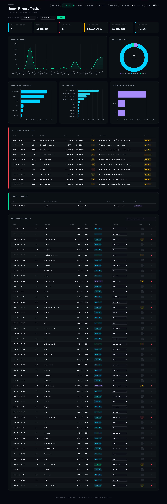

# 8Cores Finance Tracker

A self-hosted n8n workflow that reads your bank transaction notification emails, extracts amount + merchant + category with AI, applies a 4-layer risk score, pings Telegram when something looks suspicious, and serves a finance dashboard at `/webhook/finance-dashboard` with a Privacy Mode toggle that masks all `$` amounts to `***` for screen-sharing.

Privacy Mode toggle masks every `$` amount with `***`:

## What it does

1. **Backfill** (▶ 30/60/90 days, manual) or **Daily 6 AM Trigger** fetches bank emails matching your `knownBanks` list
2. **LLM extracts** structured transaction JSON from each email body (amount, merchant, category, type)
3. **Anomaly Detection** runs 4-layer risk scoring (0–100): universal rules (investments/dividends auto-flag) + statistical baselines (Z-score + IQR per category) + tier-based adjustments (GOLD/SILVER/GREY merchant trust) + contextual signals (unusual hours, velocity)
4. Flagged transactions → **Telegram alert** with LEGIT / FRAUD / FALSE ALERT inline buttons
5. Your tap-responses update the **merchant trust tier** in Postgres — the system learns who's safe over time
6. **Webhook** at `/webhook/finance-dashboard` renders Chart.js graphs with Privacy Mode toggle

## Install

1. Self-host n8n. See [n8n docs](https://docs.n8n.io/hosting/) if you do not have an instance yet.
2. In n8n: **Workflows → Add workflow → Import from File** → upload [`workflows/finance-tracker.json`](workflows/finance-tracker.json).
3. Add 4 credentials (n8n's Credentials page):
   - **Gmail OAuth** (read-only is sufficient)
   - **OpenAI-compatible LLM** (OpenRouter / OpenAI / Gemini / Groq / Ollama — `mistralai/mistral-nemo` via OpenRouter is recommended for cost: ~$0.0001 per email)
   - **Telegram Bot** (token from `@BotFather`)
   - **PostgreSQL**
4. Open the red-highlighted `⚙️ Config` node — paste `telegramChatId`, set `knownBanks` for your country (Singapore/US/UK examples included), pick `llmModel`. Inline comments link to each value's source.
5. In Telegram, send `/setup` to the bot — it creates the `fraud_detection` Postgres schema interactively.
6. Click ▶ Backfill 30 Days to populate history. When you get a fraud alert, tap a button to teach the system.

## Companion workflow

This is the V2 product in a 2-workflow series. For Gmail auto-classify with urgency alerts, see [**8cores-email-organizer**](https://github.com/spteoh111/8cores-email-organizer).

## Marketing, demos, paid setup support

Full marketing materials, live demos, and optional paid setup + maintenance services:
[**solutions.8cores.com**](https://solutions.8cores.com)

## License

MIT — see [LICENSE](LICENSE).
